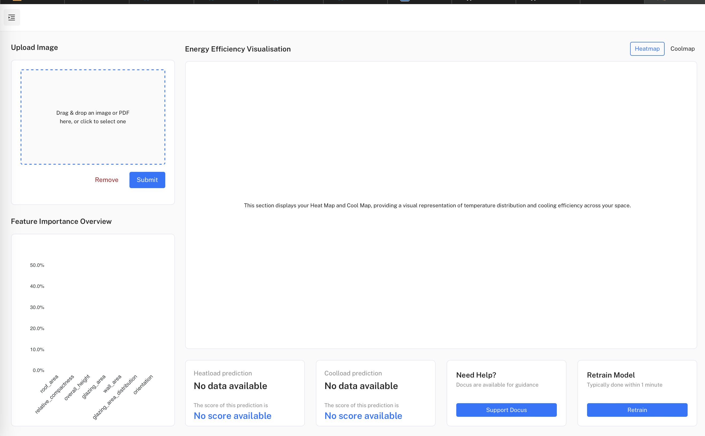
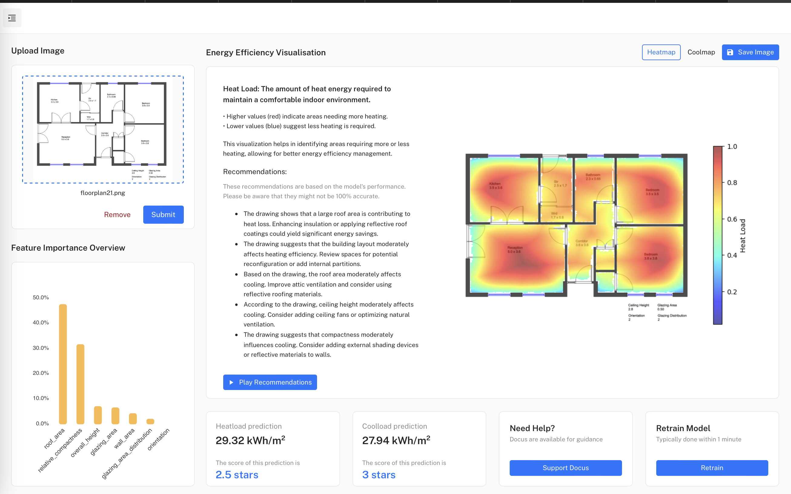

# ThermalLogic

This repository contains a basic procedure to train and deploy the DNN model, leveraging the architecture proposed in the paper [**'Deep Floor Plan Recognition using a Multi-task Network with Room-boundary-Guided Attention'**](https://arxiv.org/abs/1908.11025). The original implementation by [zlzeng/DeepFloorplan](https://github.com/zlzeng/DeepFloorplan) has been adapted to work with newer versions of Tensorflow and Python, with some enhancements to streamline the training and deployment process.

The focus of my project, **ThermalLogic**, is to evaluate and build upon this model for specific floorplan recognition tasks, while also contributing to the overall improvements in training efficiency and deployment processes. Below, I document the steps and requirements needed to replicate and expand upon the results presented in my work.

## Abstract

This dissertation focuses on developing an AI application to assess energy efficiency from building blueprints, offering early-stage design recommendations to architects and engineers for sustainable practices. The project, part of the UCL IXN initiative, also integrates IBM Watsonx for code generation and text-to-speech to support visually impaired users.

Two models are central to this work: a deep learning model for image segmentation and a machine learning model tailored to predict cooling and heating loads in residential buildings. The application interfaces with AutoCAD via a file-based web system, allowing seamless design analysis and feedback.

The AI tool predicts energy efficiency by evaluating features like compactness, orientation, and glazing. Results are visualized through heatmaps and coolmaps, guiding design improvements for better sustainability. This work advances AI in sustainable architecture and highlights collaboration between academia and industry.

## Requirements

The model can be installed and run in various environments depending on your hardware and operating system. Below is a table summarizing the installation commands based on different scenarios:

| OS     | Hardware | Application        | Command                                                                 |
|--------|----------|--------------------|-------------------------------------------------------------------------|
| Ubuntu | CPU      | Model Development  | `pip install -e .[tfcpu,dev,testing,linting]`                           |
| Ubuntu | GPU      | Model Development  | `pip install -e .[tfgpu,dev,testing,linting]`                           |
| MacOS  | M1 Chip  | Model Development  | `pip install -e .[tfmacm1,dev,testing,linting]`                         |
| Ubuntu | GPU      | Model Deployment API | `pip install -e .[tfgpu,api]`                                           |
| Ubuntu | GPU      | Everything         | `pip install -e .[tfgpu,api,dev,testing,linting,game]`                  |
| Agnostic | ...    | Docker             | (to be updated)                                                         |
| Ubuntu | GPU      | Notebook           | `pip install -e .[tfgpu,jupyter]`                                       |
| Ubuntu | GPU      | Game               | `pip install -e .[tfgpu,game]`                                          |

## How to Run

### 1. Install Packages

Choose one of the following methods depending on your preference for environment management:

#### Option 1: Python Virtual Environment

\`\`\`bash
python3 -m venv venv
source venv/bin/activate
pip install --upgrade pip setuptools wheel
\`\`\`

#### Option 2: Conda Environment (Preferred)

\`\`\`bash
conda create -n venv python=3.8 cudatoolkit=10.1 cudnn=7.6.5
conda activate venv
\`\`\`
